# Домашня робота №4

## Завдання 1. Менеджери пакетів

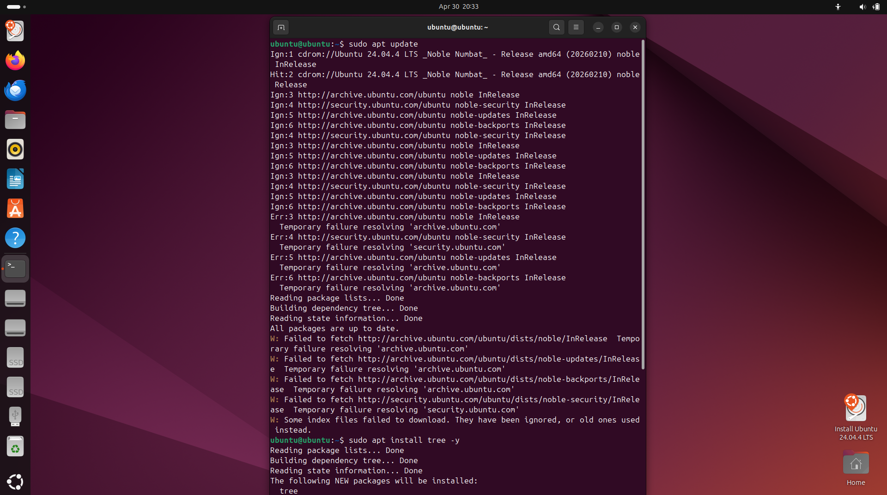
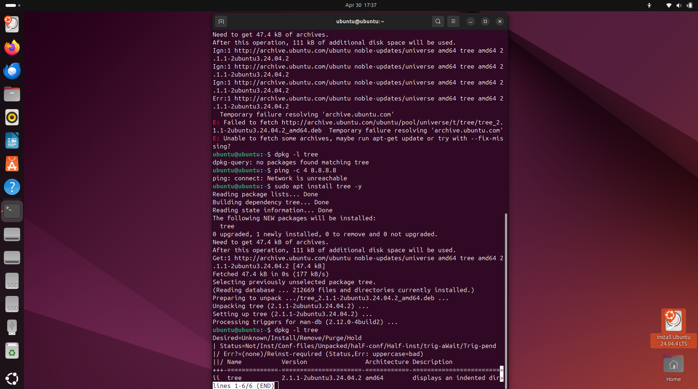
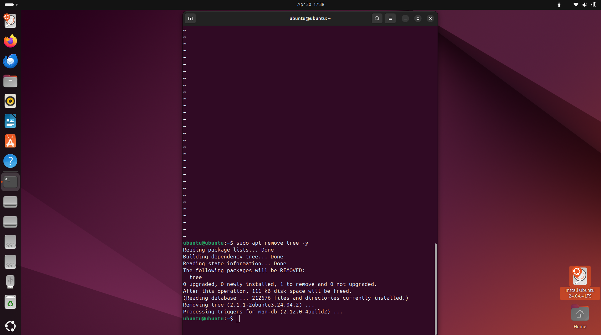
---

## Завдання 2. Керування сервісами через systemctl

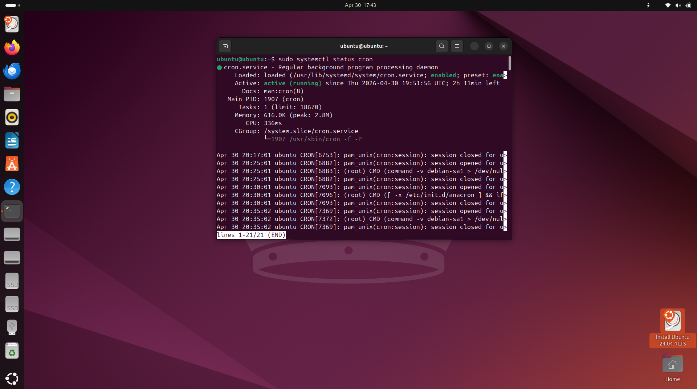
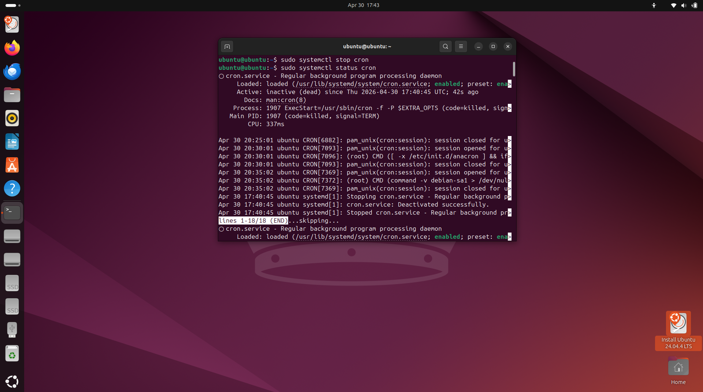
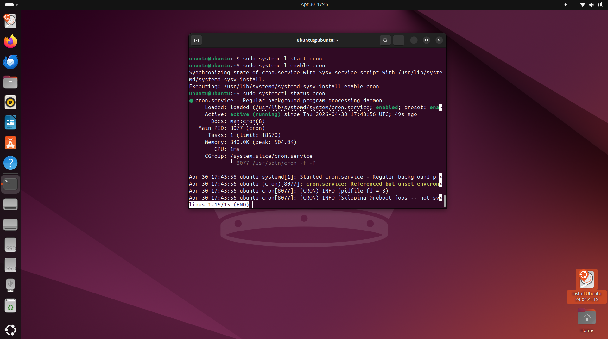

---

## Завдання 3. Робота з логами

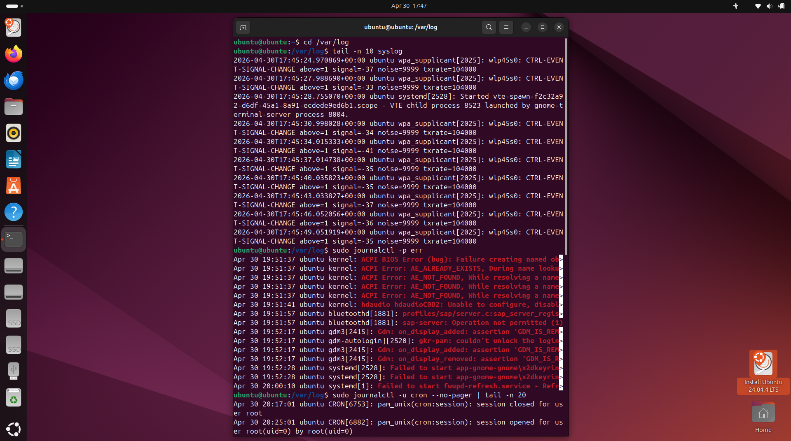
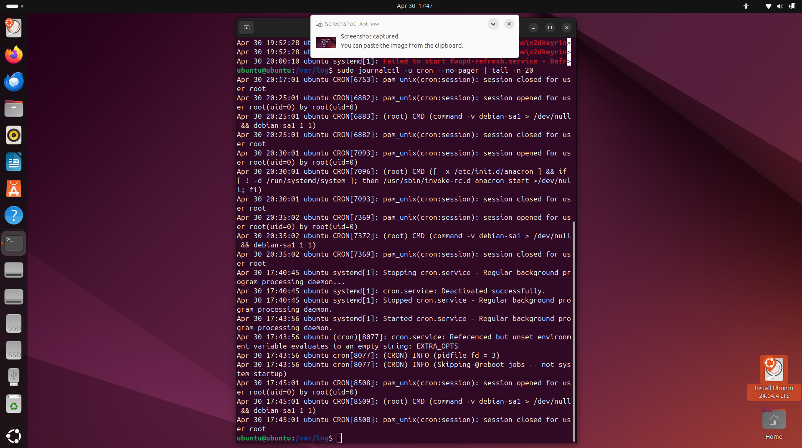
---

## Завдання 4. Створення власного сервісу

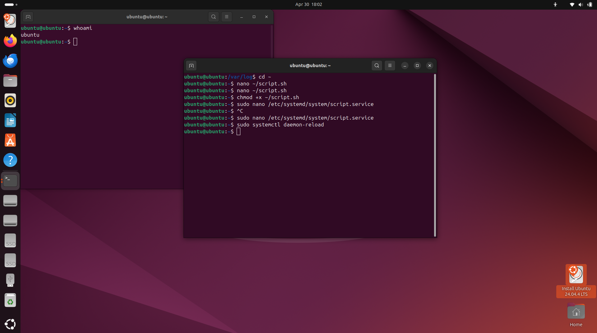
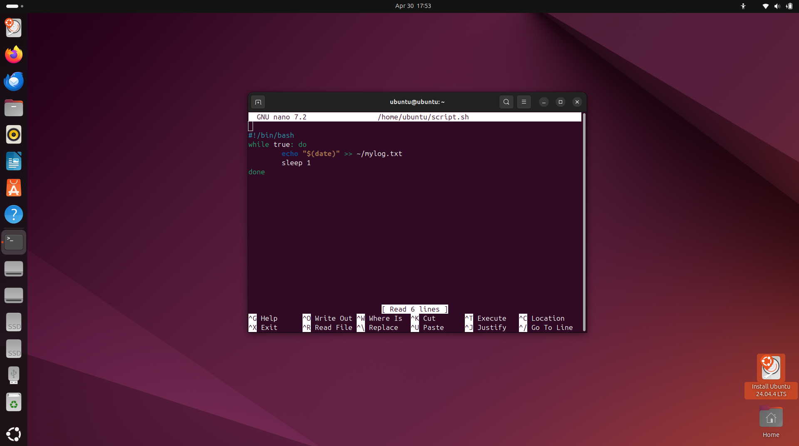
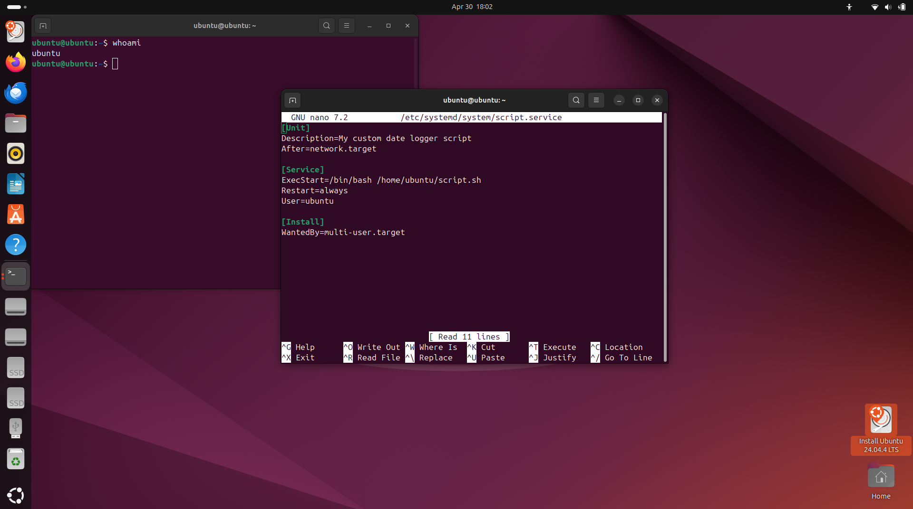
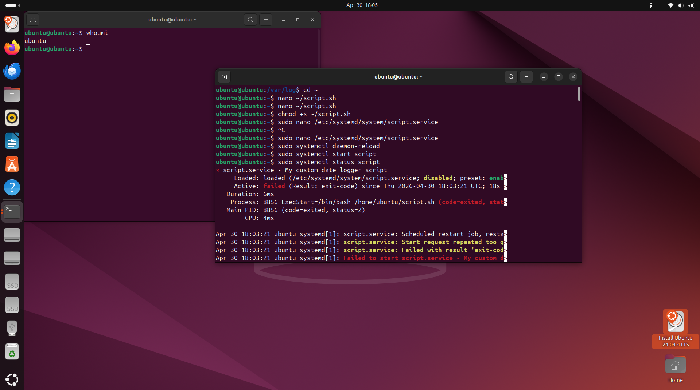
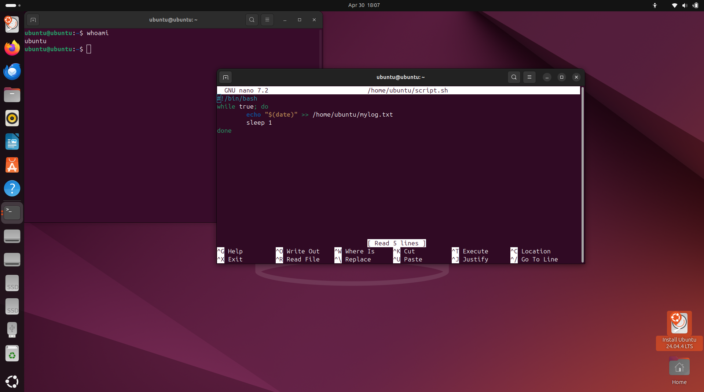
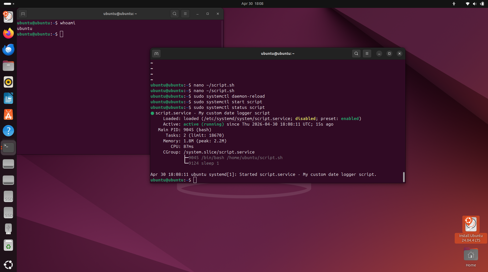
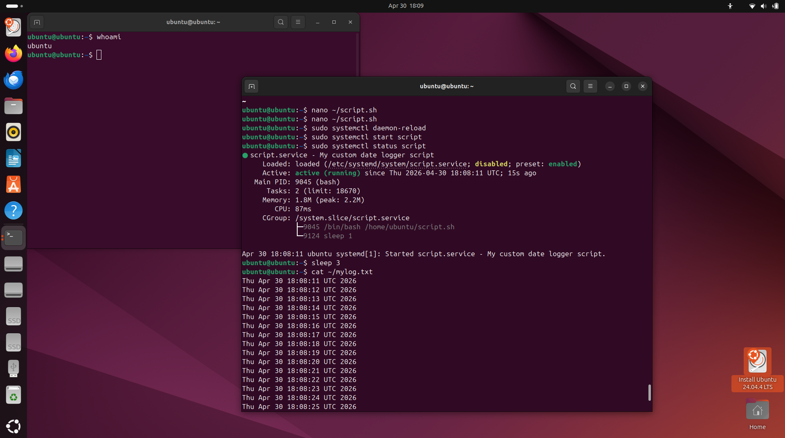
